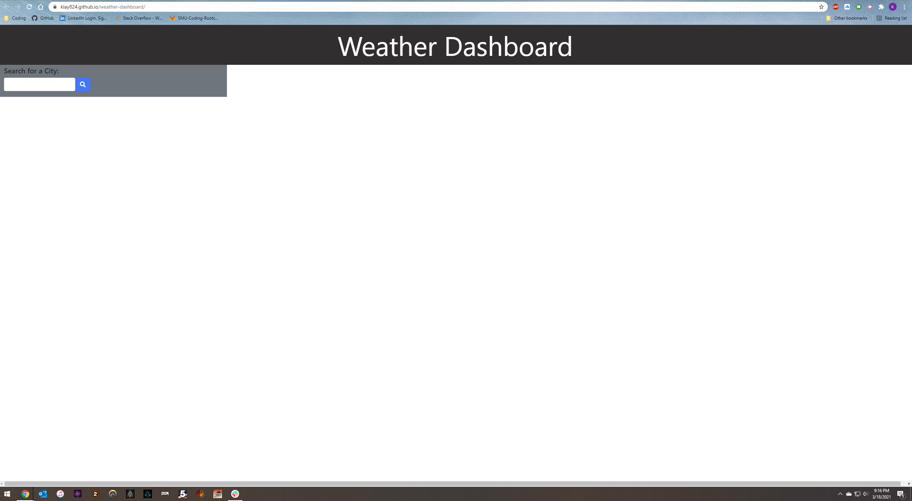
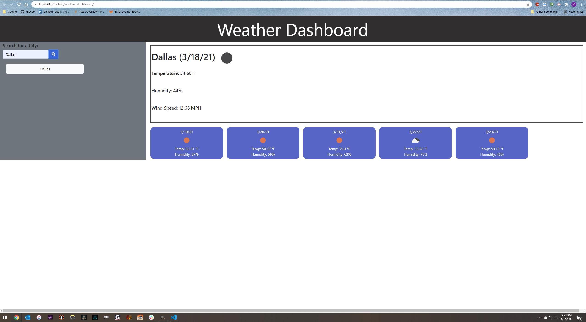
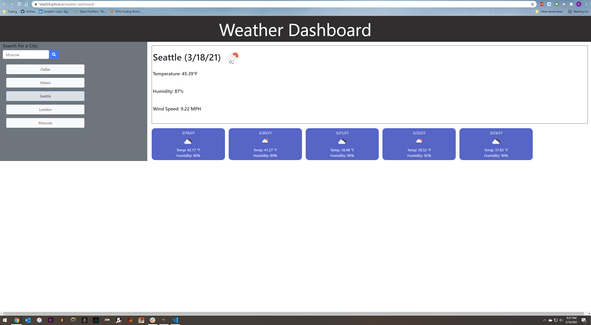

# Weather Dashboard

For this week's project I have created a weather dashboard that allows a user to type in a city and be shown today's weather and a five-day forecast.

When the user types in their city and clicks the search button or hits enter, the application will fetch the data from OpenWeatherMap and display today's date, icon representing weather conditions, temperature, humidity, and wind speed at the top-right of the page if using a desktop browser. If the user is using a mobile device, the current weather will display below the search results.  Additionally when the user clicks search, they will be presented with a five-day forecast displaying each day's date, an icon representing weather conditions, temperature, and humidity. This will appear below the current weather on desktop and mobile versions. Finally, the user's searched city will appear as a clickable button in a search history below the search bar on both desktop and mobile.  The user may click on a search history button to see the current weather conditions and the five-day forecast for that city. The user's search history is saved as persistant data so they may refresh or leave the site and return and will still be able to view and click on their past searches.

Please follow [this link](https://klay824.github.io/weather-dashboard/) to view the live application.

## Technology Used
* HTML
* CSS
* Bootstrap 4
* JavaScript
* JQuery
* Moment.js
* Server-Side APIs

## Resources
* [moment.js Documentation](https://momentjs.com/)
* [Bootstrap 4 Documentation](https://getbootstrap.com/docs/4.6/getting-started/introduction/)
* [Documentation for the OpenWeatherMap's Current Weather Data API](https://openweathermap.org/current)
* [Documentation for the OpenWeatherMap's 5 Day/3 Hour Forecast API](https://openweathermap.org/forecast5)
* Unit 6 Class Activities
* AskBCS Learning Assistants
* Our TA's Andrew and Cody

## GIF Demonstration

## Screenshots

